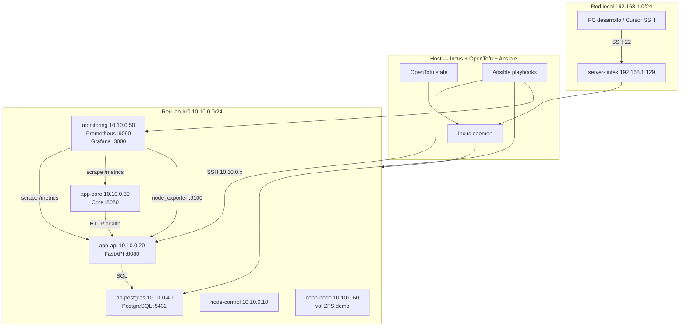
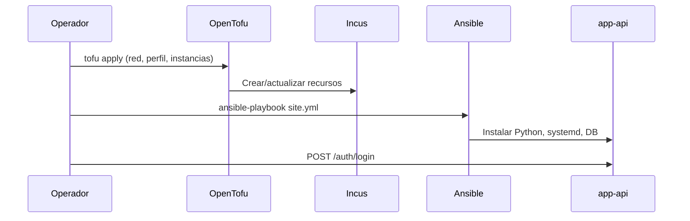
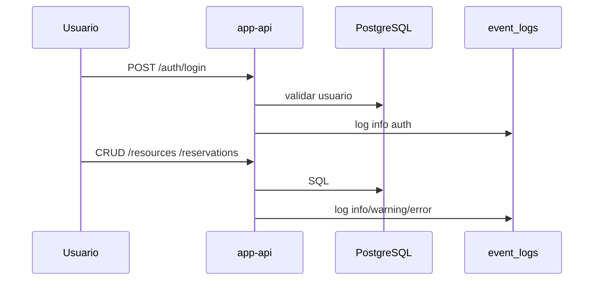

# Arquitectura y topología — Lab reservas académicas

## 1. Vista general

## 2. Topología de red

| Capa | Elemento | IP / rango | Rol |
|------|----------|------------|-----|
| Física/LAN | server-fintek | 192.168.1.129 | Host Ubuntu 24.04 |
| Bridge Incus | lab-br0 | 10.10.0.1/24 | NAT, DHCP lab |
| OVN (definido) | lab-ovn | sobre lab-br0 | Segmentación avanzada |
| Contenedor | app-api | 10.10.0.20 | API REST + auth + CRUD |
| Contenedor | app-core | 10.10.0.30 | Validación / proxy lógico |
| Contenedor | db-postgres | 10.10.0.40 | Persistencia |
| Contenedor | monitoring | 10.10.0.50 | Observabilidad |
| Contenedor | node-control | 10.10.0.10 | Nodo control |
| Contenedor | ceph-node | 10.10.0.60 | Almacenamiento demo |

## 3. Flujo de despliegue (IaC + config)

## 4. Flujo de datos de la aplicación

## 5. Stack de monitoreo

| Componente | Puerto | Qué mide |
|------------|--------|----------|
| node_exporter | 9100 | CPU, RAM, disco (por nodo) |
| API /metrics | 8080 | lab_reservations_total, lab_up |
| Core /metrics | 8080 | lab_core_up |
| Prometheus | 9090 | Scraping + alertas |
| Grafana | 3000 | Dashboard Lab Reservas |

Alertas definidas: `monitoring/prometheus/alerts-lab.yml` (ApiDown, CoreDown, HighNodeCPU).

## 6. Almacenamiento

- **Pool ZFS** `default` en el host Incus.
- Volúmenes: `db-data` → PostgreSQL, `ceph-data` → demo en ceph-node.
- Ceph: capa **didáctica** (no cluster Ceph productivo).

## 7. URLs de referencia

| Servicio | URL |
|----------|-----|
| API Swagger | http://10.10.0.20:8080/docs |
| Prometheus | http://10.10.0.50:9090 |
| Grafana | http://10.10.0.50:3000 |
| Incus UI | https://192.168.1.129:8443 |
